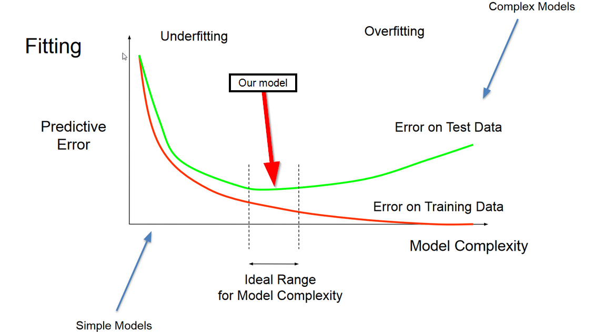

# CSE151A_Project

https://colab.research.google.com/github/austintnguyen/CSE151A_Project/blob/main/CSE151A_Project.ipynb#scrollTo=KrsjeJ04Ji1y

**Feature information:**

Age: Age in years  
Ed: 1-Did not complete high school 2-High school degree 3-Some college degree 5-Prost-undergraduate degree  
Employ: Years with current employer  
Address: Years at current address  
Income: Household income in thousands  
Debtinc: Debt to income ratio (x100)  
Creddebt: Credit card debt in thousands  
Othdebt: Other debt in thousands  
Default: The "Default" field is the target variable, indicating previous defaulted. It takes binary values, with 1 typically denoting a "bad" default status and 0 representing a "good" repayment history.  

Summary: The Bankloan dataset was initially already relatively clean, with a select amount of NaN values that didn't heavily impact the dataset size which we subsequently dropped and cleaned. We also found an unrealistic outlier in the age column which we removed. We plotted our exploratory information on a pair plot, in which we gave distinct colors to defaulting being blue and vice versa. Furthermore, we made a heatmap to find statistical comparisons of the correlation of each column variable.

**Preprocessing:**
1. Removed an unrealistic outlier for age
2. Removed all rows with atleast one NaN
3. Standardized default column to be an 0 or 1
4. Generated pair plot for the dataset
5. Normalized dataset with MinMax scalar

## Model 1 Logistic Regression

Fitting Graph: Our model is outside the range of the ideal range and towards the underfitting section of the fitting graph

Our model is outside the scope of the ideal range and leaning towards the underfitting section of the fitting graph. Our training MSE is 0.204 and our testing MSE is 0.216 which aligns with the graph as our testing MSE > training MSE. They are almost the same, which indicates that there is no overfitting. However, recall is low for data points where the loantaker defaulted. This holds true for both train and test data, which indicates that the model is not perfectly fitted. Therefore, the model seems to be slightly underfitted.

Next 2 expected models:

1. We would like to proceed to use a Deep Neural Network because we believe it would better identify complex patterns in the data that a basic logistic regression may not be able to. Specifically, since the logistic regression model seems to be underfitted, it would likely be improved by a Deep Neural Network. DNNs are also good at handling many features like we have in this dataset.
2. We plan to use a SVM for our third model. SVMs are classifiers, so they are compatible with our dataset. Further, if our data is easily separable, an SVM would be highly effective and would yield very high accuracy. We don't know for sure whether our data is separable, but it is worth giving it a shot.

Conclusion for Model 1: Using a logistic regression model resulted in moderate performance in predicting individuals who will default, however its recall score was low so our model may tend to miss a larger portion of individuals who will actually default on their loan. If our goal was to minimize the risk of the bank this model would not be very good because of our relatively high rate of false negatives which causes the model to miss a lot of cases where people would actually default. Our precision and recall for predicting if an individual defaults was .65 and .34 respectively on our testing data. By looking at our testing MSE and seeing that it was close but slightly greater than our training MSE we believe our model is under fitted.

## Model 2 Neural Network
    
We kept the same dataset and used the same features to train our model. Since our target is a binary outcome, we decided to use binary cross-entropy for our loss function as it measures the difference between predicted binary outcomes and actual binary labels. 
    
When employing MSE, our testing error was 0.20, whereas our training error was 0.17. When evaluating the error with log loss, the testing error was 7.2 and the training error was 6.34. In either scenarios, the training error was slightly lower than the testing error.

Compared to our first model, testing and training error are lower, indicating that the model is better fitted. 

We performed hyperparameter tuning on this model, tuning on the number of units for each layer, the activation function for each layer, and the learning rate. We chose to use 4 hidden layers and tuned between 8 and 64 units for each layer, with increments of 8. The tuner returned the best model as one with 16, 8, 64, 56 layers for the 4 hidden layers, and tanh as the activation function for all of them. The optimal learning rate was found to be 0.002. We trained and tested this model and got an accuracy of 0.8 for the testing data, an improvement over our previous model.

Next model: For our third and last model we will be doing a forms of Support Vector Machines, such as linear and rbf SVMs. In terms of functionality, SVMs maximize the margin between classes, promoting better generalization to unseen data, while their convex optimization ensures finding the global optimal solution. With memory efficiency and the ability to work well with both linear and nonlinear data, SVMs offer a reliable and efficient approach for classification tasks across various domains. For the types of SVMs we will explore, linear SVMs are primarily utilized for data that is seperable by a linear hyperplane. On the contrary, a radial basis function kernel allows for the classification of nonlinear and more complex decision boundaries, however could potentially result in overfitting and longer training times. We will train both, and potentially other versions such as polynomial, and decide on the best SVM model to compare with our previous logistic regression model and neural network.

Conclusion section: What is the conclusion of your 2nd model? What can be done to possibly improve it? How did it perform to your first and why?   

The primary challenge we faced with the first model was low recall score for the 1 class (paying off the loan) that is those who default. A key challenge in the banking industry is to accurately predict default levels since it directly affects profitability, in order for this model to have value we need to make sure we are able to better predict the 1 (loan paid off defaulters) class.  

Therefore we tried using used a deep neural network in order to better classify the inputs, and this led to a moderate increase in recall for the 1 class from (0.34 to 0.43) and some improvement in the 0 class, bringing our overall accuracy to 0.8, a definite improvement from model 1, especially with the significant improvement in recall for the 1 class making our model more practical.

This is clearly a classification problem and the ability to tune a DNN in order to find patterns gave us the biggest boost, being able to play around with number of layers, units and activation functions allowed the model to better find patterns within features. Moreover, the dataset is large enough for a DNN to be able to be of value, usually DNN's require large amounts of data considering the depth of layers, a larger dataset is needed to improve predictive accuracy. 

We hyperparamter tuned our DNN to improve results, however using K cross validation could be another way to better fit the data and improve performance, moreover it helps in avoiding in overfitting, although our model does not overfit as of now. That is why we stuck to hyperparamter tuning. 