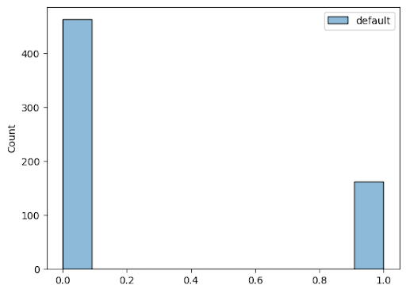
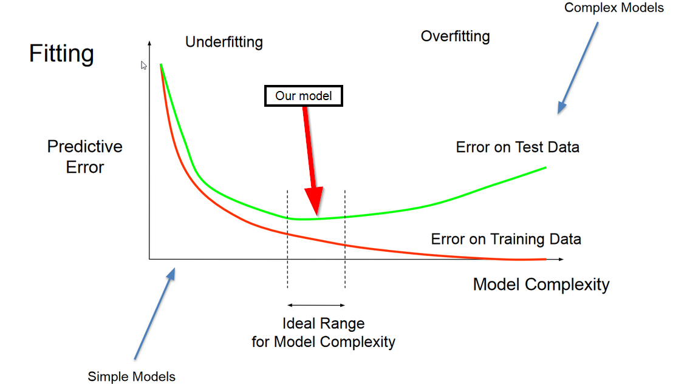

# Bank Loan Default Classifier
## Introduction
In today’s financial landscape, the usage of borrowing and loaning money as a stimulant for economic growth has been paramount for the facilitation of capital business growth as well as personal ventures. However, every loan carries an inherent risk of default, where a borrower fails to repay their loan, and can result in detrimental repercussions in the form of financial setbacks, loss of liquidity, and in worst cases, systemic crises. Coupled with this information, our decision to explore this topic was driven by the staggering statistic that three in five Americans struggle with credit card debt, which is not only relevant to our group as students dealing with student debt but also to countless others affected by similar financial challenges. By leveraging the power of machine learning, banks can streamline the previously labor-intensive tasks of manual data analysis to assess creditworthiness and mitigate risks effectively, which is what our project aims to achieve.

## Method
    
### [Data Exploration](https://colab.research.google.com/github/austintnguyen/CSE151A_Project/blob/main/CSE151A_Project.ipynb?authuser=7#scrollTo=-cBMQfNM-hhX)

The Bankloan dataset was initially already relatively clean, with a select amount of NaN values that didn't heavily impact the dataset size which we subsequently dropped and cleaned. We also found an unrealistic outlier in the age column which we removed. We plotted our exploratory information on a pair plot, in which we gave distinct colors to defaulting being orange and not defaulting being blue. Furthermore, we made a heatmap to find statistical comparisons of the correlation of each column variable.

Here is the feature information in our dataset:

- Age: Age in years
- Ed: 1-Did not complete high school 2-High school degree 3-Some college degree 5-Post-undergraduate degree
- Employ: Years with current employer
- Address: Years at current address
- Income: Household income in thousands
- Debtinc: Debt to income ratio (x100)
- Creddebt: Credit card debt in thousands
- Othdebt: Other debt in thousands
- Default: The "Default" field is the target variable, indicating previous defaulted. It takes binary values, with 1 typically denoting a "bad" default status and 0 representing a "good" repayment history.

Here is a histogram that shows the distribution of data for defaults:

Based on this histogram, we can tell that there are far more 0’s than 1’s, meaning that most people paid their loan back. Looking forward, we will have to account for that in some of our models.

Here is a pairplot that shows the relationships between all of the different columns in the dataset:

.png)

These pairplots helped us understand more about certain relationships that could help with feature selection since the blue represents default=0 and the orange represents default=1. For example, there seems to be a clear positive correlation between debtinc and othdebt, and there seems like there’s a line we can draw there that separates the blue and orange points.

Here is a heatmap that goes further in detail about the correlations:

.png)

This is a heatmap we generated to show the correlations between all of the attributes in our dataset. In this case, we are just focusing on the bottom row since we want to know which features contribute most to our target. To interpret this, a positive correlation means defaulting is more likely, whereas a negative correlation would indicate a higher probability that the loan was paid back. So from this we can tell that age, years at the same employer, and address all increase the chances of a loan being paid off as they increase. On the other hand, a higher debt-to-income ratio, a higher credit card debt, and all other sorts of debt, as we would expect, decrease the chances that someone will pay off their loan. In addition, something interesting we found was that a higher education level also slightly decreases the chance of a loan being paid off as it increases which seems counterintuitive at first. We hypothesized that this may be because people naturally take on more debt to finance higher and higher levels of education.

### [Preprocessing](https://colab.research.google.com/github/austintnguyen/CSE151A_Project/blob/main/CSE151A_Project.ipynb?authuser=7#scrollTo=adSW5-H_-lAM)
- Merged duplicate values
- Removed an unrealistic outlier for age
- Removed all rows with atleast one NaN
- Standardized default column to be an 0 or 1
- Normalized dataset with MinMax scalar

.png)

### [Model 1: Logistic Regression](https://colab.research.google.com/github/austintnguyen/CSE151A_Project/blob/main/CSE151A_Project.ipynb#scrollTo=XArebnyrKnwN)

### [Model 2: Neural Network](https://colab.research.google.com/github/austintnguyen/CSE151A_Project/blob/main/CSE151A_Project.ipynb?authuser=7#scrollTo=_68kO-KvJMRk)

### [Model 3: Support Vector Machine (SVM)](https://colab.research.google.com/github/austintnguyen/CSE151A_Project/blob/main/CSE151A_Project.ipynb?authuser=7#scrollTo=0KlSvlaKmHTP)

## Result

### Model 1 Logistic Regression

.png)   
We achieved a Testing Accuracy of 0.78 on our first model which was logistic regression and a Training Accuracy of 0.80.

The model was slightly underfitting as seen below: Our model is outside the scope of the ideal range and leaning towards the underfitting section of the fitting graph. Our training MSE is 0.204 and our testing MSE is 0.216 which aligns with the graph as our testing MSE > training MSE. 

### Model 2 Neural Network

.png)   
Our second model, the Neural network model, achieved a testing accuracy of 0.8 
and a training accuracy of 0.82. 

   
Compared to our first model, testing and training errors are lower, indicating that the model is better fitted. Additionally, the difference between testing and training errors increased. Therefore the model is likely more complex and in the ideal range on the fitting graph. When employing MSE, our testing error was 0.20, whereas our training error was 0.17.

### Model 3 SVM
SVM with kernel set to Linear, without oversampling:

.png)   

With this model, we have a testing accuracy of .77 with a testing recall of 0.28 for our 1 class.

SVM with kernel set to RBH, without oversampling:

.png)  

With this model, we have a testing accuracy of .79 with a testing recall of 0.41 for our 1 class.

SVM with kernel set to Linear, with oversampling:

.png)   
With this model, we have a testing accuracy of .71 with a testing recall of 0.69 for our 1 class. This is our best model in our opinion, because it has a relatively high accuracy with improved recall compared to our other models.

The testing MSE for this model was 0.288 and our training MSE was 0.242. This model has slightly higher MSE models compared to our previous two models, which implies that the SVM model does not have high enough complexity to reduce our error compared to our other models. We believe that lower training than testing MSE implies slight underfitting.

SVM with kernel set to RBF, with oversampling:

.png)

With this model, we have a testing accuracy of .71 with a testing recall of 0.62 for our 1 class.

## Discussion

We began with a logistic regression model because it is a simple but effective model that could provide us with a baseline from which to move upward. The logistic regression model yielded remarkably good accuracy, though recall for defaults was very low. While perfect recall is not necessary, extremely low recall suggested that the model was predicting 0 for nearly everything, which was not desirable. This, along with training and testing errors, suggested that the model was underfitted. 

Thus, in order to increase complexity, we decided to use a neural network for our second model. The neural network had a similar accuracy as the logistic regression model, but it had a markedly better recall for defaults (the “1” class). We consider this an improvement since recall was the main issue with the first model. This model was close to correctly fit.

Our third model, the SVM, was another attempt to increase the complexity of the first model. Though initial results were poor, oversampling yielded a better model. This oversampled SVM had the highest recall for defaults out of any of our models, which was a good sign; however, it sacrificed some accuracy. 

We were unable to go much higher than 80% accuracy, suggesting that this may be close to the limit on this dataset. Our Neural Net (model 2) and SVM (model 3) were both what we would consider our “best” models, but which one to use is highly dependent on the risk philosophy at the user’s bank. The neural net is the most accurate, but it often fails to predict defaults. Using it would result in more lenient loans, with many potential defaulters given a loan. That may be the aim, if the bank is looking to broaden its clientele or support communities subject to historical injustices. Meanwhile, the SVM is stricter with its loans, having a significantly higher recall for the “1” class. However, it often miscategorizes safe loans as potential defaults. Therefore, it may be a good model for banks that are risk-averse, and are willing to turn away potential borrowers at the slightest hint of default potential.

## Conclusion

What we should have done differently:   
1. Thoroughly studied existing default prediction models and created a range of acceptable metrics for our project to be of value, taking this approach may have given us a clearer expectation for our model. 
2. We also believe that we could have used our data exploration more explicitly for feature selection if we had planned our models more clearly and had more in depth knowledge of the American Credit Market.  
3. Perhaps we could have used a decision tree to be able to choose the best features since we do not have background knowledge on the dataset. 
    
While it is interesting to see if we can predict whether a loan taker will default, there are major ethical concerns. If the AI misclassifies a person who needs this loan to buy a house and start a family, this could be life changing. Therefore we have to avoid using these models to deny someone a loan. What we could do, however, is to give loans based on our predictions. This could only potentially hurt the institution giving the loan. Since our models have a high recall on the 0 class (loan was paid back) around 95% for all but the oversampled model, the institution could trust this prediction and then manually analyze the people that the model predicted to default.

The biggest realization we have had about our models is that despite our effort we were not able to predict the 1 class accurately enough, with our highest recall being 69% for our Linear SVM model after oversampling. However, given the application of this model predicting the higher risk outcome that is those who actually default is essential and hence the usability of our project would not be very high unless we are able to improve metrics on the 1 (Default) class. A possible approach to remedy this could have been to add more features for the models to calculate on or perhaps use a decision tree to help find which features were best. This is something we hope to improve in our project.  

## Collaboration

Hayden Kwok: Team Lead: Ensured the contribution of all members by scheduling meetings, delegating tasks, and managing the completion of designated milestones. Participated in all coding sessions, including data exploration, as well as model development/testing. Wrote up sections of model writeups, as well as the introduction and conclusion sections of the final writeup. 

Austin Nguyen: Project Manager: Participated and contributed to the notebook in all coding sessions. Set up and managed the GitHub and the Jupyter Notebook, and was responsible for pushing all of our changes to the repository. Assisted in the creation of all 3 models and the analysis of them in the writeups in previous milestones. Wrote up and added figures for the preprocessing section of the final writeup.

Raj Sunku: Preprocessing/Data Exploration Co-Lead: Participated in most coding sessions (data preprocessing, models 1, 2, 3) with emphasis on data preprocessing. Wrote up parts of and inserted figures for data exploration/preprocessing as well as contributing to the rest of the writeup.

Kabir Shergil: Preprocessing/Data Exploration Co-Lead: Participated in the coding sessions for data exploration/pre-processing, as well as those for constructing models 1 and 2. Was the co-lead on Data Exploration. Participated in constructing the first two models. Helped write the section of the writeup concerning Data Exploration/Preprocessing, and inserted figures/images for that portion. Overall, also provided help in tuning the Neural Network. Wrote the data part and helped to clean up and edit the final writeup.

Eban Covarrubias: Model 1 Co-lead: Participated in coding sessions regarding data processing and exploration as well as model creation (model 1, 2 and 3). In depth analysis of the results of our models with an emphasis on Model 1. Creation and review of generated figures as well as general overview of our writeups. Wrote out our conclusions regarding the first model and made note of its pros and cons.

Aiden Wise: Model 1 Co-Lead: Participated in all coding sessions and had responsibilities focusing on creating model 1. Assisted with the writeups and creations of models 1, 2, and 3. Helped write the conclusion section in the final writeup.

Sumukh Murthy: Model 2 Co-Lead: Participated in all but one coding session, including design of all models (especially model 2) and data preprocessing. Wrote parts of the Model 1, Model 2, and Model 3 reports. Also wrote the Discussion section of this final writeup.

Ishan Banerjee: Model 3 Co-Lead: Edited and curated parts of the writeup for model 3 and the final writeup. Added the results of the pre-processing section inside the final writeup. Was part of all coding sessions and contributed to the code, handling debugging issues and optimizing the performance. 

Vivin Vinil: Model 2 Co-Lead: Was part of all coding sessions throughout the quarter. Coded parts of model 1, 2 and 3 with a bigger focus on model 2 (carried out tuning and analysis). Organized resources for preprocessing from class notebooks and suggested bank loans as an interesting topic. Edited and wrote parts of all 3 model writeups, wrote parts of the conclusion and results sections of the final writeup.

Oskar Kraak: Interpretation/Evaluation Lead: Participated in all coding sessions. Summarized sessions for absent members. Interpreted results and evaluated all 3 models. Wrote up the corresponding sections in the 3 model writeups and the final writeup and added figures. Also wrote the ethical discussion in the conclusion section of the final writeup.
